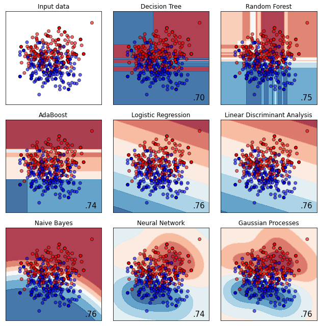
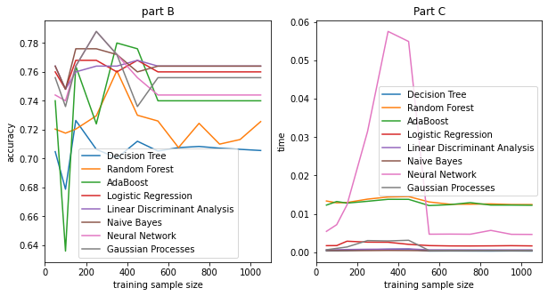
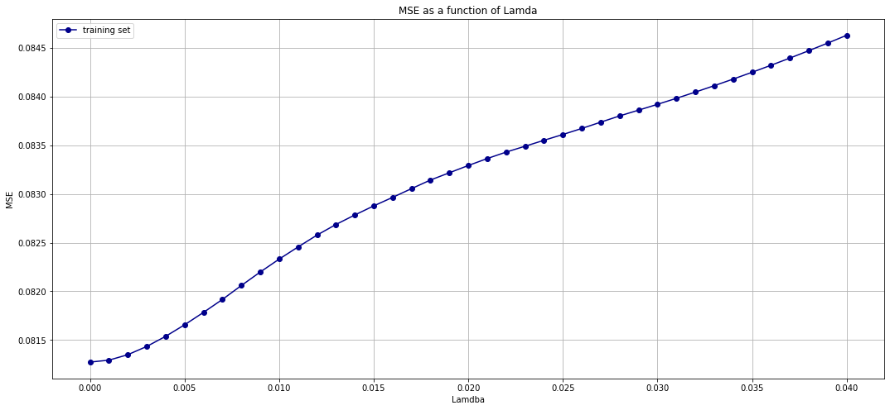
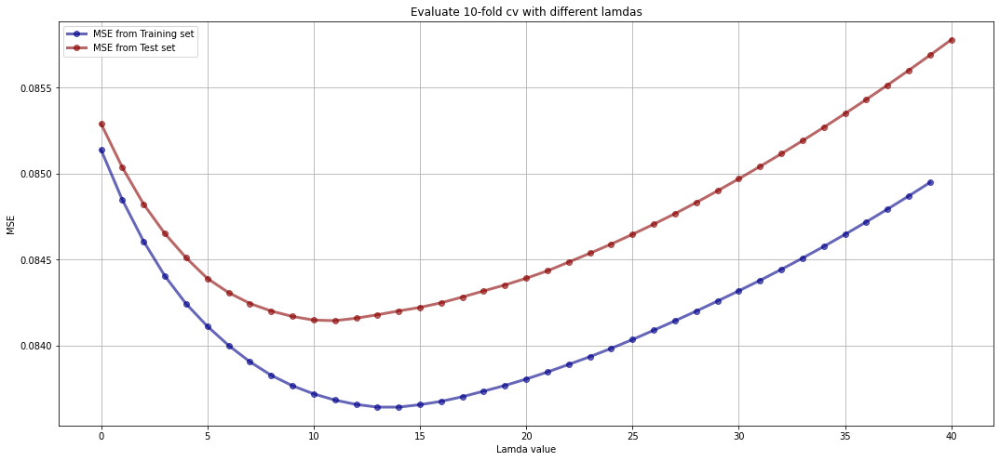
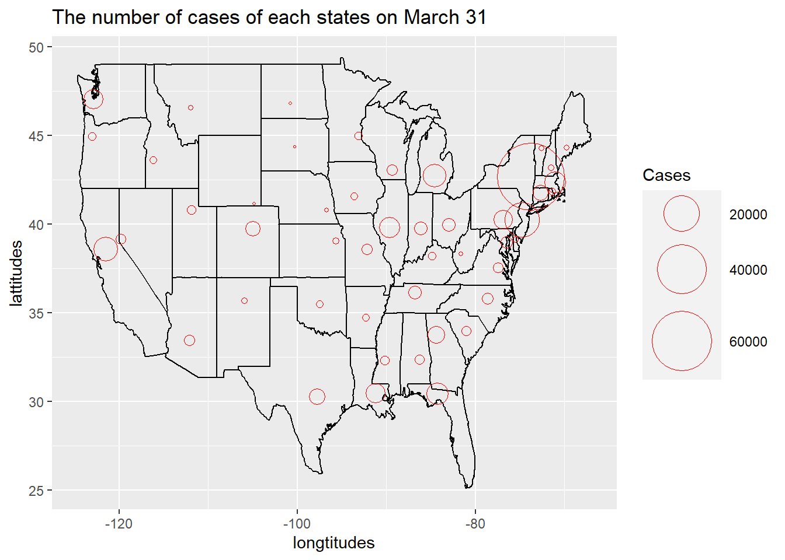

# Tao's Data Science Portfolio

Welcome to my Data Science Portfolio! This repository contains of projects I have done throughout the years of acadmeic training, self-learning, and voluntary work, etc. Connecct me on Linkedin at https://www.linkedin.com/in/tao-feng-554184a6/ 

Disclaimer: Data used in the projects in this repo is for demonstration purposes only.

## Table of Contents 

* Statistics
  
  * [OLS Analysis with Galapagos-island data](https://rpubs.com/tf642228/657767)
  * Multivariate Analysis

* Machine Learning Impletmentations
  * [Text Analysis with logisitics Regression from scratch](https://medium.com/@tf642228/text-analysis-with-logistics-linear-model-in-python-35ceeb57f74c)
  
* Machine Learning Algorithm 
  * [Comparison of different Classifier Models with `sklearn`](https://github.com/TaoFeng1234/Tao_Portfolio/blob/master/CompraisonofClassifers.ipynb)
  
   In this practice, I first compare the performance of different classifier models on a given binary classification task. Then I test how the performance of each of the classifiers varies as the size of the training set increase. 
  
   
  
   
  
  Observation: The accuracy for each decision tree, random forest, and AdaBoost starts at a relatively low rate. The accuracy increases as the size of the training dataset increase. The accuracy for logistic regression, LDA, NB, Neural Network, SVM and Gaussion Processes strats high and did not chance much as the size of the training set increases. 
  
  *Reference: https://scikit-learn.org/stable/auto_examples/classification/plot_classifier_comparison.html#sphx-glr-auto-examples-classification-plot-classifier-comparison-py
  

  * [Lasso Regression MSE vs Lambda](https://github.com/TaoFeng1234/Tao_Portfolio/blob/master/LassoEstimate.ipynb)
  
  The Lasso object is to minimize RSS($\beta$) + $\lambda\sum_{i}\beta_{i}$. 
  In this project, I first fit the LR on the training data and calculate the MSE on the training set with $\lambda$ chose from 0 to 0.04 with a step of 0.001. Plot below shows different lambda with the corrsesponding training MSE.
  
   
  
  With 10-fold cross validation implementomg on the training set to select $\lambda$. Plot below compares the
MSE on the hold-out set with the true MSE which is computed on the test set. The best $\lambda$ value could be achieved around 13.

   
  
* Nonlinear Optimization (MATLAB)

* Variational Methods in Image Processing (Framework developed by Professor Eric Baer at The University of Chicago) 

* Mini Projects

  * Plot new COVID-19 cases on a bubble map [[Code]](https://github.com/TaoFeng1234/Tao_Portfolio/blob/master/MiniProjects/co-vid19%20cases.Rmd)
    
    
